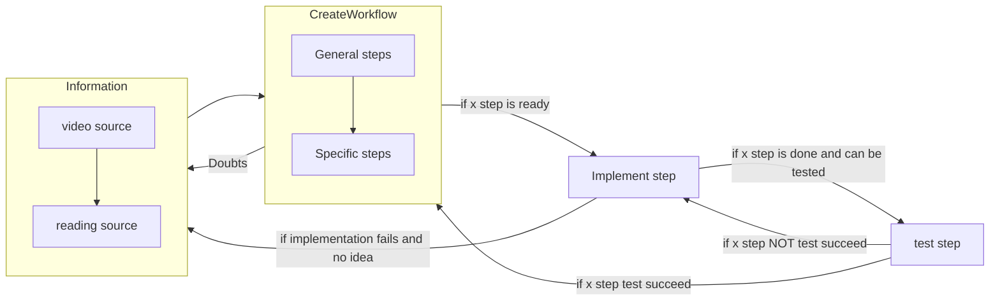
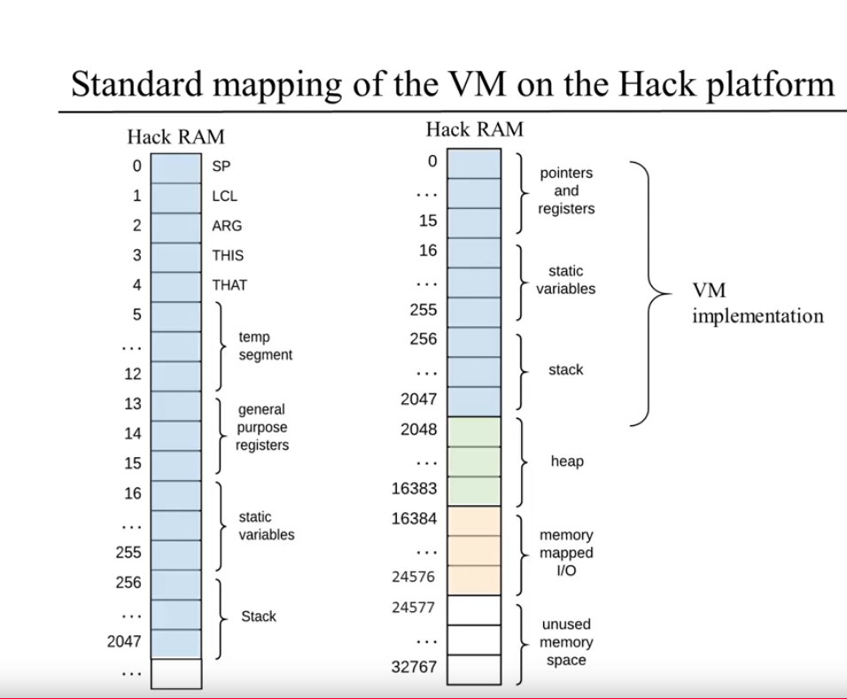

# Vm

## Notes

- Thinking in how I will solve the vm-translator

## Glosary

- vm-translator := lambda vm_code: -> hack_object_code

## Workflow order

## VM on Hack platform mapping

## Goal

- Create a vm translator

## Steps

- First I know what is a vm-translator, already defined in glosary.
- Second, how this vm-translator can be build.
    - First follow the API done by the course and
      try to understand why all the different functions are there.
    - Second understand the overall Idea
- Third Implement the API using C or C++

- I will read the API directly and try to understand the why of each function
- Giving an example and reasons of what they needed to be done.

### Understanding process

- Workflow propossed by them --> **main -> parser -> codeWritter**
- Parser Module

    - Handles the parsing of a single .vm file (this means takes care of split each command coming from the .vm file getting the different fields needed separated), provides convenient access to their components, (removes all white space and comments, this could be instead of removed ignored)

        - (-- Understood good idea could be determine those components )

            - What are those components. Basically we can see them checking
              vm files examples in such a way we will know how they look like.

                - ok, done I can see they have command such as 'push constant 7'
                  push --> put in the top of an stack
                  constant --> take in care the mamory segment "constant"
                  7 --> here I have a doubt, I don't know if that 7 is putted
                  in the memory segment 'constant' and also added to the stack
                  or if is only added to the stack. I will look for that.
                  Basically what happens is that the stack is filled with the value
                  in the 'constant'[7] I think that constant segment is
                  already defined, and it will be an array of 32767+1 elements
                  each cell represent the value itself. There is never pop constant
                  so I think my deduction was right.

                - So the memory segments
                    - argument: is an array dynamically generated
                    - local: is an array dynamically generated with
                      locals initialized to 0 because it will contain the cells
                      according to the number of variables and those == 0.
                    - static: allocated by vm, so pop from the stack to fill this
                      memory segment.
                    - constant: is an array with fixed size [32767+1]
                    - this/that: --> select the heap (Not yet understood)
                    - pointer: array with fixed size [2] -> pointer[0] == &this ^ pointer[1] == &that
                    - temp: fixed array size[8]

- I will read but keeping in mind that now what I need to really understand is the
  memory management

- Basically I kind of understood what we have to do with push instruction
  here is the following
  ej: push constant 17
  we need to translate this to assembly_languague
  push constant 17 -------> stack[sp] = 17 ------->
  ---------> tmp = ram[0]
  ram[tmp] = 17
  ram[0] = ram[0]+1

push constant 17 if constant
Finally that will be
I can test this
RAM[0] = 257
@17
D=A

<!-- @16 -->
<!-- M=D -->

@17
D=A
@sp === @0
A=M // A = RAM[0] => RAM[257] selected
M=D
@0
M=M+1
else
push arg 1
arg | lcl | this | that
RAM[0] = 257
RAM[2] = 974
@arg2
D=A
@2 --> arg1
A=M+D
D=M
@0
A=M
M=D
@0
M=M+1

<!-- @jump -->
<!-- M=D -->
<!-- //u -->
<!-- @jump -->
<!-- D=M -->

//
pop <memory_segment> index

<!-- pop pointer 0 -->

pop argument 1
@0
M=M-1
A=M
D=M
@0
A=M
D=M
@2
A=M
pop is more complex because I need to retrieve the value

@tmp
M=D
@arg2
D=A
@2
A=M+D
M=

pop argument 1
@0
M=M-1
A=M
D=M
@16 ->val
M=D
@arg2 -> 1
D=A
@arg -> @2
D=M+D
@17 ->tmp
M=D
@16
D=M
@17
A=M
M=D

// this calculation has to be done in the vm

<!-- @arg2 -->
<!-- M=A -->

@2
A=M
D=M+D

for the moment is not important to see where to start
the different memory segments, I was looking for that
so I will divide this in 4
[256,2047]
1791
358
sp -> [256,614]
lcl -> [615,973]
arg -> [974,1332]
this-> [1333,1691]
that -> [1692,2047]

i wanted to do it cleaner but i think the pop will be done embedding code

Ok so I have a traduction of pop and push to assembly

Now I was writting the traduction for arithmetic commands
here is the following idea
so basically is done for binary operations
the idea is i setting to 0 the the last 2 registers pointed from sp pointer
so basically what will happen is that
if there is a line add
what should happen is pop + pop + operation + push operatio_result
not using pop already done beacuse that pop alterates the memory segment selectionated
so that pop does 'remove' the last two values inside the registers whose address is sp-1 && sp-2
then i update sp to sp-2 so it will be pointing where the next push instruction should put the value

so c_arithmetic
"@0" + "\n" +
"A=M-1" + "\n" +
"M=0" + "\n" +
"D=A" + "\n" +
"D=D-1" + "\n" +
"@16" + "\n" +
"A=D" + "\n" +
"M=0" + "\n" +
"@0" + "\n" +
"M=M-1" + "\n" +
"@0" + "\n" +
"M=M-1" + "\n";

- Now I kind of know how to test the translator
  there is an small difference between the expected translation
  and is the following so basically in the pop implementation
  i thought of setting the register to 0, simulating the real pop
  operation that decrease the 'sp' and remove the element from the stack
  i think???
- Now I will keep going for the next test and implement those operations in the software lvl

- The error is in StackTest.vm:41 -- neg, should modify the sp-1 not sp-2
- Finally got it the problem was before the order of the command needed to take them in account and also the
  labels assigned to each one.

- I have to do some things I forgot to do an actually there are some mapping errors
  so basically this is what I should do

    - The code writter instead of creating tmp variables starting from reg#16 it should start from 256
      this is because from [15--256) is booked for static variables

    - I need to also consider the case the line command is a pointer (this/that) and embed the index 3 or 4
      this mean taken the register 3 or 4 for following the convention.

    - Ok the operations I do as getting the negatives values and stuff like that  
      I could put them in the general purpose registers. R13-R15

### chapter 8

- First I determine the goal --> extends the vm with the ability to enable function call mechanism

- abstract crucial information even if I have seen the video
  and read about it I didn't do it really deeply
  now I will take crucial information in order to elaborate an general workflow

- Now I can do the following I can check the test, and check what are the diff between those
  files and the files previously tested in chapter 7

#### Steps

- Implement program flow
    - basic_loop
    - fibonacci
- Implement function calling command

#### Things to understand

- functions mechanism
    - caller
    - callee
