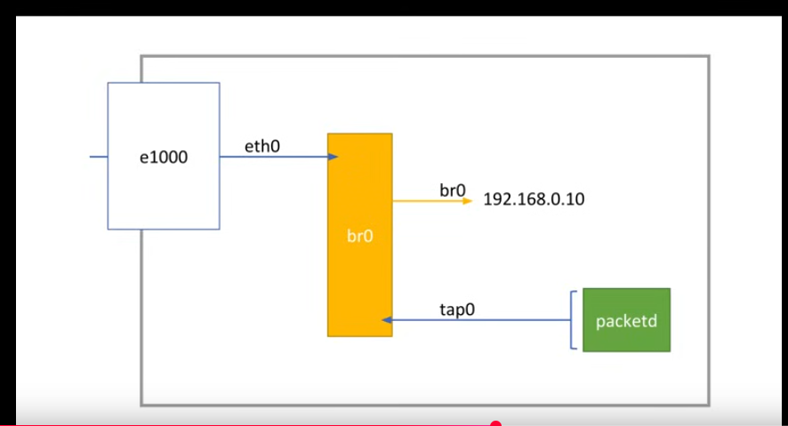

# Virtualisation

## Important link

- [redhat linux networking_1](https://developers.redhat.com/blog/2018/10/22/introduction-to-linux-interfaces-for-virtual-networking#)
- [redhat linux networking_2](https://developers.redhat.com/blog/2018/10/22/introduction-to-linux-interfaces-for-virtual-networking#)

- [software networking and interfaces](https://www.youtube.com/watch?v=EnAZB8GI97c&t=2171s)
- [crack doing networking](https://www.youtube.com/watch?v=VCAqkyVd7dM&t=244s)

## What is

Software that simulate hardware

## Notes

Qemu popular vm in linux

## Usage

### Creating disk

- For creating disk
-

```
qemu-img create -f qcow2 HDA.img 10G
```

- -f --> stands for format
- qcow2 --> Is a format for file disk that qemu understand
- HDA.img --> image name
- 10G --> image capacity

### Creating vm

```
qemu-system-x86_64 -cdrom ~/Downloads/isos/archlinux-2024.12.01-x86_64.iso -boot d -cpu host -enable-kvm -smp 2 -m 2G
```

This is telling qemu to create a virtual machine with the following hardware capacities

- -cdrom --> will have embedded the image
- -boot --> will have the way of booting in this case is a disk instead of the hardisk
- -cpu --> tells if taking or not host hardware capabilities is setted as host
  host architecture must be the same that the vm's
- -enable-kvm --> This allow to have accelerator so quicker performance
- -smp --> Assign number of cpus assigned to the vm
- -m --> Assign RAM capacity of the vm

### Vm networking (Libvirt/Bridge)

Comparison at the network interfaces when activating default network by libvirt through virsh

```
diff ./beforeNetwork ./afterNetwork

16a17,24
> virbr0: flags=4099<UP,BROADCAST,MULTICAST>  mtu 1500
>         inet 192.168.122.1  netmask 255.255.255.0  broadcast 192.168.122.255
>         ether 52:54:00:86:b5:2b  txqueuelen 1000  (Ethernet)
>         RX packets 0  bytes 0 (0.0 B)
>         RX errors 0  dropped 0  overruns 0  frame 0
>         TX packets 0  bytes 0 (0.0 B)
>         TX errors 0  dropped 2 overruns 0  carrier 0  collisions 0
>
21c29
<         RX packets 169011  bytes 143424229 (136.7 MiB)
---
>         RX packets 169211  bytes 143443705 (136.7 MiB)
23c31
<         TX packets 52840  bytes 19056560 (18.1 MiB)
---
>         TX packets 52903  bytes 19064229 (18.1 MiB)

```

- First using libvirt through virsh for starting "default network"
  vm attach by this default network by default

- I am not getting that virbr0-nic (bridge between physical network card and virtual machine virtual network card)
- What is happenign is the following

    - that new interface created virbr0 acts like a virtual switch (switch connets multiple nodes )
    - Then when I start an vm another interface got created (tap interface)
    - vm is tight to vnet0

- dnsmasq --> like DHCP server

#### Libvirt default network

- by default

#### Bridge network

-

#### Attaching vms to the bridge

####

- tun0
- NAT
- ip forwarding
- tap0

#### Understood and doubts

According of what I have understood, libvirt is creating
a linux bridge (virtual switch) and each time I assign
a vm. As it use NAT, the vm should not be visible to the outside world let's try it out.

- Ok I understood the following as libvirt created the virtual switch (linux bridge)
  my machine is able to comunicate with the virtual machines through networking
  because my machine is by default attached to that bridge I think so when the
  ping command see the ip it will switch automatically to the correct interfaces

- create a way to enable an outsider the vms

- DHCP sever is the one that have an iptable and assign ips dynamically
- DNS translates domain names into IP addresses

###

- https://www.youtube.com/watch?v=VCAqkyVd7dM&t=244s
  In this video the guy is doing the following for giving internet connection
  to the vm, so basically he is creating linux virtual switch by creating a
  linux bridge and to that bridge he is plugging the ethernet () to the bridge
  and for pluggin the vm he needs to create a kind of connector for that he uses
  a TAP interface that enables to be plugged to a switch
  
- it was what I was thinking

### Give networking to vm without libvirt

As the vm is given a private ip assigned by qemu this ip doesn't have a gateway that provide it with actual internet,
so what we will do is change this settup

#### Steps

- Create a linux bridge (virtual switch)

- Once the virtual switch is created, we have to plug in it the different
  machines.

- Also as now we are redirecting the eth0 that is the interface connected to the NIC
  and is where we are really reciving the internet packets, we need to remove eth1 the ip-address done by our dhcp server and define an static ip address to the bridge, in such a way the bridge will be the one exposed IMPORTANT! this will messed up with the dns (This part I need to investigate a little bit more)

- For connecting a vm to the linux bridge, a TAP interface needs to be created this will be the connector between the virtual interface of the vm  
  and the virtual switch (bridge) residing in the host.

- now the settup will be that our bridge will have attached the actual interface that is handling the actual NIC

    and also the vm/containers via tap that is a way to create a link between virtual machines and virtual switches

- Finally we will have a scheme like the following
  
